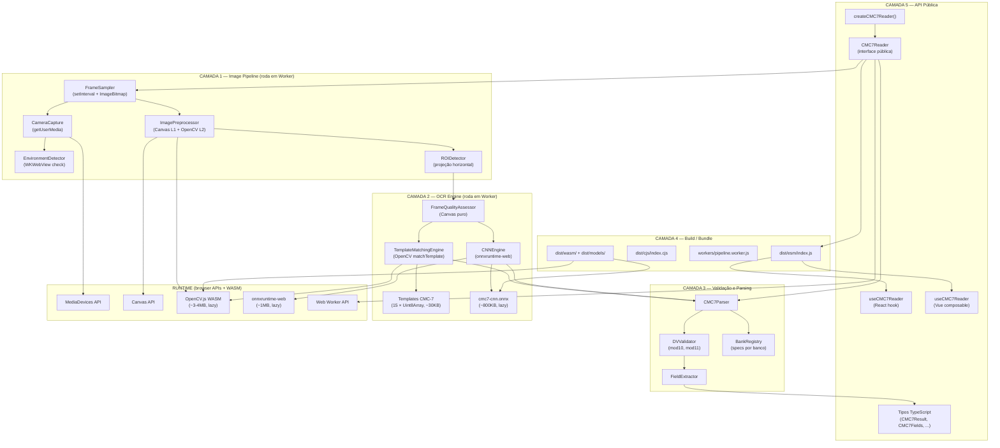

# Arquitetura Técnica — `cmc7-ocr-parser`

> **Versão:** 1.0-draft  
> **Data:** 2026-04-08  
> **Baseado em:** `docs/01-viabilidade.md` + `docs/02-prd.md`  
> **Linguagem:** TypeScript (strict mode)

---

## Visão Geral

A biblioteca é organizada em **5 camadas verticais** — da mais fundamental (hardware/browser APIs) até a mais abstrata (interface pública/npm). Cada camada depende somente da camada imediatamente abaixo. O fluxo de dados é unidirecional descendente na inicialização e ascendente na execução.

```
┌──────────────────────────────────────────────────────────────────┐
│  CAMADA 5 — API Pública / NPM Package                           │
│  CMC7Reader · createCMC7Reader() · Types · Events               │
├──────────────────────────────────────────────────────────────────┤
│  CAMADA 4 — Integração de Frameworks / Bundle                   │
│  ESM + CJS · Tree-shaking · Lazy loaders · React/Vue wrappers   │
├──────────────────────────────────────────────────────────────────┤
│  CAMADA 3 — Validação e Parsing                                 │
│  CMC7Parser · DVValidator · BankRegistry · FieldExtractor       │
├──────────────────────────────────────────────────────────────────┤
│  CAMADA 2 — OCR Engine                                          │
│  TemplateEngine · CNNEngine (ONNX) · QualityAssessor            │
├──────────────────────────────────────────────────────────────────┤
│  CAMADA 1 — Image Pipeline                                      │
│  CameraCapture · ImagePreprocessor · ROIDetector · FrameSampler │
└──────────────────────────────────────────────────────────────────┘
          ↕ (WASM / Browser APIs / Node.js APIs)
┌──────────────────────────────────────────────────────────────────┐
│  RUNTIME LAYER (não faz parte da lib, mas é dependência)        │
│  OpenCV.js WASM · onnxruntime-web · MediaDevices API · Canvas   │
└──────────────────────────────────────────────────────────────────┘
```

---

## Camada 1 — Image Pipeline

A camada de imagem é responsável por: (a) adquirir frames da câmera ou aceitar imagens estáticas; (b) aplicar pré-processamento para maximizar a acurácia do OCR; (c) detectar e recortar a Região de Interesse (ROI) — a faixa CMC-7 no terço inferior do cheque.

---

### 1.1 — Módulo de Captura: `CameraCapture`

**Responsabilidade:** Gerenciar o ciclo de vida do `MediaStream`, extrair frames para processamento e detectar ambientes incompatíveis.

#### Decisão Técnica: Estratégia de Captura de Frames

**Opções consideradas:**

| Opção | Descrição | Prós | Contras |
|-------|-----------|------|---------|
| **A: `requestAnimationFrame` + throttle** | Extrai frames a cada N ms usando rAF | Sincronizado com renderização; nativo | Roda na main thread; pode causar jank |
| **B: `setInterval` em Web Worker + `OffscreenCanvas`** | Worker solicita frames via mensagens | Não bloqueia main thread | OffscreenCanvas não disponível em Safari <16.4 |
| **C: `ImageCapture API` + `grabFrame()`** | API dedicada para captura de frames | Mais eficiente em hardware | Não suportada no Safari (nenhuma versão) |

**Decisão: Opção A com transferência de `ImageBitmap` para Worker**

Usar `setInterval` na main thread *apenas* para capturar o frame via `canvas.drawImage(videoElement)` e chamar `createImageBitmap()`. O `ImageBitmap` criado é transferido (zero-copy via `Transferable`) para um Web Worker que executa todo o processamento pesado. A main thread nunca processa pixels diretamente.

**Justificativa:**
- `OffscreenCanvas` não tem suporte no Safari iOS < 16.4, inviabilizando a Opção B como padrão (PRD RNF-002).
- `ImageCapture` é incompatível com Safari (PRD RNF-002).
- `ImageBitmap` é transferível para Workers sem cópia, eliminando o custo de serialização de pixels.
- A captura em si (drawImage → createImageBitmap) é sub-ms; o overhead na main thread é aceitável.

**Referência PRD:** RF-002 (captura stream), RF-009 (não bloquear thread principal), RNF-002 (compatibilidade Safari).

---

**Detecção de WKWebView:**

```typescript
// src/capture/environment-detector.ts
export function detectEnvironment(): EnvironmentInfo {
  const ua = navigator.userAgent;
  const isIOS = /iPad|iPhone|iPod/.test(ua);
  const isSafari = /Safari/.test(ua) && !/Chrome|CriOS|FxiOS/.test(ua);
  const hasGetUserMedia = !!(navigator.mediaDevices?.getUserMedia);

  return {
    isIOS,
    isSafari,
    isWKWebView: isIOS && !isSafari,  // iOS + não-Safari = WKWebView
    hasCamera: hasGetUserMedia,
    isHTTPS: location.protocol === 'https:' || location.hostname === 'localhost',
  };
}
```

---

### 1.2 — Módulo de Pré-Processamento: `ImagePreprocessor`

**Responsabilidade:** Transformar um frame bruto de câmera (colorido, possivelmente inclinado e com ruído) em uma imagem binária de alta qualidade pronta para OCR.

#### Decisão Técnica: Engine de Processamento de Imagem

**Opções consideradas:**

| Opção | Bundle | Performance Mobile | Funcionalidades | Licença |
|-------|--------|-------------------|----------------|---------|
| **A: OpenCV.js (build completa)** | ~8–9 MB WASM | Boa | Total (Canny, HoughLines, morphology, etc.) | Apache 2.0 |
| **B: OpenCV.js (build customizada `core`+`imgproc`)** | ~3–4 MB WASM | Boa | Suficiente para o pipeline | Apache 2.0 |
| **C: Canvas API pura + aritmética de pixels** | 0 KB | Variável (JS puro) | Limitada (threshold global, recorte) | N/A |
| **D: `jimp` (puro JS)** | ~400 KB | Lenta (JS puro) | Threshold global, resize, crop | MIT |
| **E: Híbrido: Canvas para operações simples + OpenCV lazy para avançadas** | ~3–4 MB lazy | Boa | Total | Apache 2.0 + N/A |

**Decisão: Opção E — Arquitetura Híbrida com dois níveis**

**Nível 1 (Canvas API pura, síncrono, zero dependência):**
- Conversão para escala de cinza
- Redimensionamento do frame para resolução de trabalho (960px de largura máxima)
- Crop da ROI de busca (terço inferior da imagem)
- Estimativa rápida de qualidade (variância de Laplaciano via JS puro para blur detection)

**Nível 2 (OpenCV.js, carregado lazy, WASM):**
- Threshold adaptativo (`cv.adaptiveThreshold`)
- Operações morfológicas de limpeza (erosão/dilatação mínimas)
- Deskew via análise de componentes conectados (PCA dos bounding boxes)
- `findContours` para segmentação dos caracteres

**Justificativa:**
- O Nível 1 permite rejeitar frames de baixa qualidade *sem* pagar o custo do WASM, economizando ciclos de CPU em mobile.
- O Nível 2 (OpenCV.js com build customizada) é carregado uma única vez via `import()` dinâmico e fica em cache.
- Build customizada usando apenas os módulos `core`, `imgproc` e `features2d` resulta em ~3–4 MB (PRD RNF-003: ≤ 4 MB).
- Sem requisito de headers CORP/COOP usando build single-thread (mitiga PRD Risco R5 / Premissa P-04).

**Referência PRD:** RF-004, RNF-001 (300ms em mobile), RNF-003 (bundle ≤ 4 MB).

---

#### Pipeline de Pré-Processamento Detalhado

```
Frame (JPEG/câmera)
    │
    ▼
[1] Resize → max 960px largura (mantendo aspect ratio)
    │         Canvas API - ~2ms
    ▼
[2] Grayscale → ImageData manipulation (R*0.299 + G*0.587 + B*0.114)
    │            Canvas API - ~5ms
    ▼
[3] Quality Check → Laplacian variance (blur), histogram spread (contrast)
    │                JS puro - ~10ms
    │                SE score < threshold → emite 'frame-quality' e PARA
    ▼
[4] ROI Crop → Extrai terço inferior (y: 60%–100%)
    │           Canvas API - ~1ms
    ▼
[5] Adaptive Threshold → cv.adaptiveThreshold (ADAPTIVE_THRESH_GAUSSIAN_C)
    │                     OpenCV.js - ~20ms
    ▼
[6] Morphological Clean → cv.erode + cv.dilate com kernel (3×1)
    │                      OpenCV.js - ~15ms
    ▼
[7] Deskew → Analyze component bounding boxes → PCA → warpAffine
    │          OpenCV.js - ~30ms (omitido se inclinação < 1°)
    ▼
[8] Line Detection → Horizontal projection profile → localizar faixa CMC-7
    │                 OpenCV.js + JS - ~20ms
    ▼
[9] Final Crop → Recortar apenas a faixa da linha CMC-7
                  Canvas API - ~1ms

Total estimado: ~105ms em mobile mid-range (OpenCV.js já carregado)
```

**Implementação da detecção de faixa CMC-7 via projeção horizontal:**

```typescript
// src/pipeline/roi-detector.ts
export function detectCMC7Strip(binaryMat: cv.Mat): { y: number; height: number } | null {
  // Projeção horizontal: soma de pixels pretos por linha
  const projection = new Array(binaryMat.rows).fill(0);
  const data = binaryMat.data;
  
  for (let row = 0; row < binaryMat.rows; row++) {
    for (let col = 0; col < binaryMat.cols; col++) {
      if (data[row * binaryMat.cols + col] === 0) { // pixel preto
        projection[row]++;
      }
    }
  }

  // Encontrar região com densidade de pixels pretos > 15% da largura
  const threshold = binaryMat.cols * 0.15;
  // ... sliding window para encontrar região contígua com alta densidade
  // Retorna y e height da faixa detectada
}
```

---

### 1.3 — Módulo de Qualidade: `FrameQualityAssessor`

Executa no Nível 1 (Canvas puro, antes do WASM) para economizar recursos:

| Métrica | Algoritmo | Threshold de rejeição |
|---------|-----------|----------------------|
| **Blur** | Variância do Laplaciano (kernel 3×3 via JS) | Variância < 80 |
| **Contraste** | Desvio padrão do histograma de luminância | σ < 30 |
| **Brilho excessivo** | % de pixels com luminância > 240 | > 20% |
| **Tamanho mínimo** | Largura do frame | < 400px |

---

## Camada 2 — OCR Engine

A camada de OCR recebe a faixa CMC-7 pré-processada (imagem binária, ~960×80px) e retorna a string de caracteres reconhecidos.

---

### 2.1 — Decisão Técnica: Estratégia de Reconhecimento CMC-7

Esta é a decisão mais crítica da arquitetura. O PRD (RF-005) permite tanto template matching quanto CNN via ONNX, com escolha configurável.

**Opções consideradas:**

| Opção | Acurácia Esperada | Bundle | Latência (mobile) | Esforço de ML | Licença |
|-------|------------------|--------|-------------------|--------------|---------|
| **A: Template Matching (OpenCV `matchTemplate`)** | 93–97% pós-seg. | ~0 KB extra | ~50ms | Nenhum | Apache 2.0 |
| **B: CNN custom + ONNX Runtime Web** | 98–99% pós-seg. | ~500KB–2MB | ~30–80ms | Alto (treinamento) | MIT (runtime) |
| **C: Tesseract.js + traineddata CMC-7 custom** | 90–95%+ pós-seg. | ~10–20MB (traineddata) | 500ms–2s | Alto (tesstrain) | Apache 2.0 |
| **D: CRNN end-to-end (sem segmentação)** | 95–99% | ~5–20MB | ~100–300ms | Muito alto | Depende |

**Decisão: Dual-Engine com Template Matching como padrão e CNN como alternativa selecionável**

```
recognitionMode: 'template'  → TemplateMatchingEngine (padrão, zero-ML)
recognitionMode: 'cnn'       → CNNEngine via onnxruntime-web (~1.5MB ONNX)
```

**Justificativa:**

1. **Template Matching como padrão:**
   - CMC-7 tem exatamente 15 caracteres com formas únicas e convexidade específica — ideal para template matching.
   - Não requer nenhuma dependência adicional além do OpenCV.js já carregado.
   - Acurácia de 93–97% é suficiente para o MVP quando combinada com validação de DV (um caractere errado frequentemente invalida o DV).
   - Permite entrega mais rápida: não requer pipeline de treinamento.

2. **CNN como alternativa:**
   - Para casos onde as condições de câmera são difíceis (iluminação variável, cheques velhos), a CNN supera o template matching.
   - O usuário da biblioteca pode escolher via `recognitionMode: 'cnn'` após benchmark no seu ambiente.
   - O modelo ONNX (~1.5 MB quantizado) é carregado lazy apenas quando `recognitionMode: 'cnn'` é especificado.

3. **Tesseract.js descartado:**
   - Bundle do traineddata (5–20 MB) viola RNF-003.
   - Latência de 500ms–2s viola RNF-001.
   - Treinamento customizado exige toolchain Linux/Docker, aumentando custo de manutenção.

4. **CRNN descartado para o MVP:**
   - Elimina a segmentação, mas exige modelo maior e muito mais dados de treinamento.
   - Reservado como plano B se a segmentação não atingir 90% de acurácia (PRD Risco R1).

**Referência PRD:** RF-005, RNF-001, RNF-003, Premissa P-03, Risco R1.

---

### 2.2 — `TemplateMatchingEngine`

#### Segmentação de Caracteres

```
Imagem binária da faixa CMC-7 (~960×80px)
    │
    ▼
[1] findContours → lista de bounding boxes de componentes conectados
    │
    ▼
[2] Filtrar contornos por tamanho
    │   min_height: 30% da altura da faixa
    │   max_height: 95% da altura da faixa
    │   min_width:  5% da largura média esperada por caractere
    ▼
[3] Ordenar por posição X (esquerda → direita)
    │
    ▼
[4] Merge de contornos próximos (distância < 5px → mesmo caractere)
    │   [necessário para CMC-7: alguns caracteres têm partes desconectadas]
    ▼
[5] Normalizar cada segmento → 32×64px (grayscale)
    │
    ▼
[6] matchTemplate contra os 15 templates em 3 escalas
    │   Retorna: (char, score, boundingBox)[]
    ▼
[7] Reconstruir string CMC-7 a partir das posições X
```

#### Templates

Os 15 templates CMC-7 são armazenados como dados binários embutidos no bundle principal (não como arquivo de fonte CMC-7 TTF). Cada template é uma imagem 32×64px em escala de cinza, armazenada como `Uint8Array` base64 inline.

- **15 templates × 32×64 × 1 byte = 30.720 bytes ≈ 30 KB** (antes de compressão)
- Com gzip do bundle, contribuição real: ~8–10 KB
- Mitiga o Risco R6 do PRD (licença da fonte TTF): distribuímos apenas os dados derivados (rasterizações fixas), não a fonte em si.

```typescript
// src/ocr/templates/index.ts — gerado em build time por script Python
export const TEMPLATES: Record<CMC7Char, Uint8Array> = {
  '0': new Uint8Array([/* ... pixels 32×64 ... */]),
  '1': new Uint8Array([/* ... */]),
  // ...
  '\u2446': new Uint8Array([/* símbolo ⑆ */]),
  '\u2447': new Uint8Array([/* símbolo ⑇ */]),
  '\u2448': new Uint8Array([/* símbolo ⑈ */]),
  '\u2449': new Uint8Array([/* símbolo ⑉ */]),
  '\u244A': new Uint8Array([/* símbolo ⑊ */]),
};
```

---

### 2.3 — `CNNEngine` (via onnxruntime-web)

#### Arquitetura do Modelo

```
Input: [1, 1, 64, 32]  (batch=1, channels=1, height=64, width=32)
    │
    ├─ Conv2d(1→16, 3×3) + ReLU
    ├─ MaxPool2d(2×2)
    ├─ Conv2d(16→32, 3×3) + ReLU
    ├─ MaxPool2d(2×2)
    ├─ Conv2d(32→64, 3×3) + ReLU
    ├─ AdaptiveAvgPool2d(4×4)
    ├─ Flatten → 1024
    ├─ Linear(1024→256) + ReLU + Dropout(0.3)
    └─ Linear(256→15)  [15 classes CMC-7]

Output: [1, 15]  — logits por classe
```

Tamanho estimado (FP32): ~2.5 MB. Com quantização INT8: ~700 KB. Com quantização INT8 dinâmica ONNX: **~800 KB**.

#### Pipeline de Treinamento (one-time, fora da lib)

```
tools/train/
├── generate_dataset.py        # Gera imagens sintéticas com fonte CMC-7 TTF
│   ├── renderiza cada char em 5 fontes de tamanho
│   ├── augmentation: ruído gaussiano, erosão leve, variação de brilho
│   └── save → train/ e val/ com estrutura de pastas por classe
├── train_model.py             # PyTorch, treina a CNN acima
│   ├── epochs: 30, lr: 1e-3, scheduler: CosineAnnealing
│   └── early stopping com val_accuracy
├── export_onnx.py             # Exporta e quantiza para ONNX INT8
└── validate_model.py          # Benchmark no dataset de câmera real
```

**Referência PRD:** RF-005, RNF-001, RNF-003, Premissa P-07.

---

### 2.4 — `FrameQualityAssessor` (extensão, pré-OCR)

Executado antes de qualquer OCR pelo Worker. Retorna decisão binária (prosseguir / descartar frame) e razões.

```typescript
// src/ocr/quality/assessor.ts
export interface QualityReport {
  score: number;         // 0–100
  issues: QualityIssue[];
  shouldProcess: boolean;
}

export type QualityIssue =
  | 'blur'           // Laplacian variance < 80
  | 'low-contrast'   // Histogram std < 30
  | 'glare'          // >20% pixels sobreiluminados
  | 'too-far'        // Linha CMC-7 detectada mas muito pequena
  | 'angled'         // Inclinação > 20° (deskew não conseguirá corrigir)
  | 'no-strip-found' // Faixa CMC-7 não localizada
```

---

## Camada 3 — Validação e Parsing

Camada 100% TypeScript puro, sem dependências externas. Determinística. Testável com unit tests simples.

---

### 3.1 — `CMC7Parser`

**Responsabilidade:** Receber a string bruta reconhecida (ex: `"⑆001234567890123⑆00000010000⑇1⑈00100000000⑉00010234567⑊"`) e extrair campos estruturados.

#### Gramática CMC-7 Brasileira

```
CMC7Line ::= ⑆ Block1 ⑆ Block2 ⑇ N ⑈ Block3 ⑉ Block4 ⑊

Block1 ::= bankCode(3) agency(4..5) account(7..8) checkNum(6) DV(1)
Block2 ::= encodedValue(10) DV(1)
N      ::= sequentialNum(1)
Block3 ::= bankIdentifier(10) DV(1)
Block4 ::= accountFull(10) DV(1)
```

> ⚠️ A estrutura interna dos blocos varia por banco. O parser usa `BankRegistry` para determinar os offsets corretos.

```typescript
// src/parser/cmc7-parser.ts
export class CMC7Parser {
  constructor(private readonly bankRegistry: BankRegistry) {}

  parse(raw: string): ParseResult {
    const segments = this.splitBySymbols(raw);
    if (!this.isValidStructure(segments)) {
      return { success: false, error: 'INVALID_STRUCTURE' };
    }
    
    const bankCode = this.extractBankCode(segments[0]);
    const bankSpec = this.bankRegistry.getSpec(bankCode);
    
    return {
      success: true,
      fields: bankSpec
        ? this.parseWithSpec(segments, bankSpec)
        : this.parseGeneric(segments, bankCode),
    };
  }
}
```

---

### 3.2 — `DVValidator`

**Responsabilidade:** Validar os dígitos verificadores de cada campo CMC-7.

#### Algoritmos implementados

```typescript
// src/validation/dv-validator.ts

/**
 * Módulo 10: pesos alternados 2 e 1, da direita para esquerda.
 * Usado na maioria dos campos CMC-7.
 */
export function mod10(digits: string): number {
  let sum = 0;
  let weight = 2;
  for (let i = digits.length - 1; i >= 0; i--) {
    const product = parseInt(digits[i]) * weight;
    sum += product > 9 ? product - 9 : product;
    weight = weight === 2 ? 1 : 2;
  }
  return (10 - (sum % 10)) % 10;
}

/**
 * Módulo 11: pesos 2–7 cíclicos, da direita para esquerda.
 * Usado em campos de conta de alguns bancos (BB, Caixa, etc.).
 */
export function mod11(digits: string, weights = [2, 3, 4, 5, 6, 7]): number | 'X' {
  let sum = 0;
  let wi = 0;
  for (let i = digits.length - 1; i >= 0; i--) {
    sum += parseInt(digits[i]) * weights[wi % weights.length];
    wi++;
  }
  const remainder = sum % 11;
  if (remainder < 2) return 0;
  if (remainder === 1) return 'X'; // Alguns bancos usam X; outros usam 0 ou 1
  return 11 - remainder;
}
```

---

### 3.3 — `BankRegistry`

**Responsabilidade:** Repositório das especificações de parsing e validação por banco COMPE.

```typescript
// src/validation/bank-registry.ts
export interface BankSpec {
  compeCode: string;       // 3 dígitos
  name: string;
  dvAlgorithm: 'mod10' | 'mod11' | 'mod11-variant';
  block1Layout: Block1Layout;
  notes?: string;
}

export interface Block1Layout {
  agencyDigits: number;    // Geralmente 4 ou 5
  accountDigits: number;   // Geralmente 7 ou 8
  checkNumDigits: number;  // Geralmente 6
}

// Dados hard-coded (gerados de spec pública / FEBRABAN)
export const BANK_REGISTRY: Record<string, BankSpec> = {
  '001': { compeCode: '001', name: 'Banco do Brasil', dvAlgorithm: 'mod11', ... },
  '033': { compeCode: '033', name: 'Santander', dvAlgorithm: 'mod10', ... },
  '104': { compeCode: '104', name: 'Caixa Econômica Federal', dvAlgorithm: 'mod11-variant', ... },
  '237': { compeCode: '237', name: 'Bradesco', dvAlgorithm: 'mod10', ... },
  '341': { compeCode: '341', name: 'Itaú', dvAlgorithm: 'mod10', ... },
  // ... expandido iterativamente conforme PRD Risco R3
};
```

**Premissa P-05 do PRD:** As specs por banco ainda precisam ser curadas. O `BankRegistry` é projetado para ser extensível — o consumidor pode registrar bancos adicionais via `reader.registerBank(spec)`.

---

### 3.4 — `FieldExtractor`

Transforma o resultado do `CMC7Parser` + `DVValidator` no tipo final `CMC7Fields` + `CMC7Validation`:

```typescript
// src/parser/field-extractor.ts
export class FieldExtractor {
  extract(parseResult: ParseResult, dvResult: DVResult): { fields: CMC7Fields; validation: CMC7Validation } {
    return {
      fields: {
        bankCode: parseResult.bankCode ?? null,
        agency: parseResult.agency ?? null,
        account: parseResult.account ?? null,
        checkNumber: parseResult.checkNumber ?? null,
        rawSymbols: parseResult.symbolPositions,
        parseWarnings: parseResult.warnings,
      },
      validation: {
        isValid: dvResult.allValid && !parseResult.hasErrors,
        bankCodeValid: dvResult.bankCodeRecognized,
        checkDigitsValid: dvResult.status,
        errors: dvResult.errors,
      },
    };
  }
}
```

---

## Camada 4 — API Pública

### 4.1 — Interface Principal: `CMC7Reader`

```typescript
// src/index.ts — ponto de entrada público

/**
 * Factory function — único ponto de criação do reader.
 * Retorna Promise para permitir inicialização assíncrona do WASM.
 */
export async function createCMC7Reader(
  options?: CMC7ReaderOptions
): Promise<CMC7Reader>;

/**
 * Interface principal da biblioteca.
 */
export interface CMC7Reader {
  // === Modo Stream ===
  
  /** Inicia captura de câmera e processamento contínuo. */
  start(videoElement: HTMLVideoElement): Promise<void>;
  
  /** Inicia câmera internamente (sem videoElement externo). */
  startCamera(container?: HTMLElement): Promise<HTMLVideoElement>;
  
  /** Para o stream e libera todos os recursos (câmera, WASM memory, workers). */
  stop(): Promise<void>;

  // === Modo Imagem Estática ===
  
  /** Processa uma imagem única e retorna o resultado. */
  readImage(
    input: HTMLImageElement | ImageBitmap | File | Blob | string
  ): Promise<CMC7Result>;

  // === Eventos (EventEmitter pattern) ===
  
  on(event: 'result', handler: (result: CMC7Result) => void): this;
  on(event: 'frame-quality', handler: (report: FrameQualityReport) => void): this;
  on(event: 'error', handler: (error: CMC7Error) => void): this;
  on(event: 'unsupported-environment', handler: (info: EnvironmentInfo) => void): this;
  on(event: 'reading', handler: () => void): this;
  off(event: string, handler: Function): this;

  // === AsyncIterator (alternativa aos eventos) ===
  
  /** Itera sobre resultados CMC-7 detectados até stop() ser chamado. */
  [Symbol.asyncIterator](): AsyncIterator<CMC7Result>;

  // === Extensibilidade ===
  
  /** Registra especificações de banco não incluídas no registry. */
  registerBank(spec: BankSpec): void;
}
```

---

### 4.2 — Tipos TypeScript Completos

```typescript
// src/types/index.ts

// ─── Opções ────────────────────────────────────────────────────────

export interface CMC7ReaderOptions {
  /** Engine de reconhecimento CMC-7. Padrão: 'template' */
  recognitionMode?: 'template' | 'cnn';
  
  /** Intervalo entre análises de frame em ms. Padrão: 300 */
  frameIntervalMs?: number;
  
  /** Score mínimo de qualidade do frame (0–100) para processar. Padrão: 40 */
  minFrameQualityScore?: number;
  
  /** Constraints de câmera passadas ao getUserMedia. */
  cameraConstraints?: MediaTrackConstraints;
  
  /** URL base para carregamento dos assets WASM/modelo (para CDN customizada). */
  assetsBaseUrl?: string;
  
  /** Features experimentais (não recomendadas para produção). */
  experimental?: ExperimentalOptions;
}

export interface ExperimentalOptions {
  /** Tenta extrair valor numérico manuscrito. Requer confirmação humana. */
  handwrittenValue?: boolean;
}

// ─── Resultado ─────────────────────────────────────────────────────

export interface CMC7Result {
  /** String CMC-7 bruta com caracteres Unicode (ex: "⑆001...⑊"). */
  raw: string;
  /** Campos extraídos e estruturados. */
  fields: CMC7Fields;
  /** Resultado da validação de dígitos verificadores. */
  validation: CMC7Validation;
  /** Score de qualidade do frame processado (0–100). */
  frameQuality: number;
  /** Tempo total de processamento em ms. */
  processingTimeMs: number;
  /** Dados de features experimentais (undefined se não ativadas). */
  experimental?: ExperimentalResult;
}

export interface CMC7Fields {
  /** Código COMPE do banco (3 dígitos). */
  bankCode: string | null;
  /** Número da agência. */
  agency: string | null;
  /** Número da conta. */
  account: string | null;
  /** Número do cheque. */
  checkNumber: string | null;
  /** Posições dos 5 símbolos delimitadores na string bruta. */
  symbolPositions: Record<'⑆' | '⑇' | '⑈' | '⑉' | '⑊', number[]>;
  /** Avisos de parsing (ex: banco sem spec registrada). */
  parseWarnings: ParseWarning[];
}

export type ParseWarning =
  | 'bank-spec-unknown'      // Banco não registrado no BankRegistry
  | 'ambiguous-field-length' // Tamanho do campo não determinável sem spec
  | 'partial-parse';         // Só parte da linha foi parseada com confiança

export interface CMC7Validation {
  /** true somente se todos os DVs validaram E nenhum erro crítico. */
  isValid: boolean;
  /** null se o banco é desconhecido e não foi possível validar o código do banco. */
  bankCodeValid: boolean | null;
  /** Resultado da validação dos dígitos verificadores. */
  checkDigitsValid: 'valid' | 'invalid' | 'unknown';
  /** Lista detalhada de erros de validação. */
  errors: ValidationError[];
}

export interface FrameQualityReport {
  score: number;
  issues: QualityIssue[];
  suggestion?: 'move-closer' | 'reduce-glare' | 'stabilize' | 'improve-lighting';
}

export type QualityIssue = 'blur' | 'low-contrast' | 'glare' | 'too-far' | 'angled' | 'no-strip-found';

export interface ExperimentalResult {
  handwrittenValue?: {
    value: string | null;
    confidence: number;
    requiresConfirmation: true; // Sempre true — nunca omitir
  };
}

// ─── Erros ─────────────────────────────────────────────────────────

export type CMC7Error =
  | CMC7NotFoundError
  | CMC7UnsupportedEnvError
  | CMC7InitError
  | CMC7InvalidInputError
  | CMC7PermissionError;

export interface CMC7NotFoundError {
  type: 'CMC7_NOT_FOUND';
  message: string;
  frameQuality: number;
}

export interface CMC7UnsupportedEnvError {
  type: 'UNSUPPORTED_ENVIRONMENT';
  message: string;
  environment: EnvironmentInfo;
  userGuidance: string; // Ex: "Por favor, abra este link no Safari"
}

export interface CMC7InitError {
  type: 'INIT_ERROR';
  message: string;
  cause: 'wasm-load-failed' | 'model-load-failed' | 'webassembly-not-supported';
}

export interface CMC7InvalidInputError {
  type: 'INVALID_INPUT';
  message: string;
  receivedType: string;
}

export interface CMC7PermissionError {
  type: 'CAMERA_PERMISSION_DENIED';
  message: string;
}

// ─── Misc ───────────────────────────────────────────────────────────

export interface EnvironmentInfo {
  isIOS: boolean;
  isSafari: boolean;
  isWKWebView: boolean;
  hasCamera: boolean;
  isHTTPS: boolean;
}

export interface ValidationError {
  field: 'bankCode' | 'agency' | 'account' | 'checkNumber' | 'block1' | 'block2' | 'block3' | 'block4';
  expected: number;
  received: number;
  algorithm: 'mod10' | 'mod11' | 'unknown';
}
```

---

### 4.3 — Lifecycle e Fluxo de Execução

```
createCMC7Reader(options)
    │
    ├─ detectEnvironment() → se UNSUPPORTED: retorna reader degrado (emite evento mas não crasha)
    │
    ├─ loadOpenCVWASM()     → import('./wasm/opencv.js') — lazy, em paralelo
    │
    └─ if (options.recognitionMode === 'cnn'):
         loadONNXModel()    → import('onnxruntime-web') + fetch('./models/cmc7-cnn.onnx')

reader.start(videoElement)
    │
    ├─ getUserMedia({ video: { facingMode: 'environment', ... } })
    │
    └─ spawnWorker('./workers/pipeline.worker.js')
         │
         └─ setInterval(frameIntervalMs):
               │
               ├─ captureFrame() → canvas.drawImage → createImageBitmap → postMessage(bitmap)
               │
               └─ [WORKER] onMessage(bitmap):
                     ├─ QualityAssessor.assess() → se score < min: postMessage('frame-quality') e CONTINUA
                     ├─ ImagePreprocessor.process() → Mat binária
                     ├─ ROIDetector.detect() → faixa CMC-7
                     ├─ OCREngine.recognize() → string raw
                     ├─ CMC7Parser.parse() → CMC7Fields
                     ├─ DVValidator.validate() → CMC7Validation
                     └─ postMessage('result', CMC7Result)

reader.stop()
    ├─ clearInterval
    ├─ worker.terminate()
    ├─ stream.getTracks().forEach(t => t.stop())
    └─ OpenCV.Mat.delete() (liberar memória WASM)
```

---

## Camada 5 — Integração

### 5.1 — Estrutura do Pacote NPM

```
cmc7-ocr-parser/
├── package.json
├── src/
│   ├── index.ts                    # Ponto de entrada público
│   ├── capture/
│   │   ├── camera-capture.ts
│   │   └── environment-detector.ts
│   ├── pipeline/
│   │   ├── image-preprocessor.ts
│   │   ├── roi-detector.ts
│   │   └── frame-sampler.ts
│   ├── ocr/
│   │   ├── template-engine.ts
│   │   ├── cnn-engine.ts
│   │   ├── quality/
│   │   │   └── assessor.ts
│   │   └── templates/
│   │       └── index.ts            # Templates gerados em build time
│   ├── parser/
│   │   ├── cmc7-parser.ts
│   │   └── field-extractor.ts
│   ├── validation/
│   │   ├── dv-validator.ts
│   │   └── bank-registry.ts
│   ├── workers/
│   │   └── pipeline.worker.ts      # Bundled separadamente
│   └── types/
│       └── index.ts                # Todos os tipos exportados
├── dist/
│   ├── esm/                        # ES Modules
│   │   ├── index.js
│   │   └── index.d.ts
│   ├── cjs/                        # CommonJS
│   │   └── index.cjs
│   ├── workers/
│   │   └── pipeline.worker.js      # Web Worker bundle
│   ├── wasm/
│   │   └── opencv.wasm             # OpenCV custom build
│   └── models/
│       └── cmc7-cnn.onnx           # Apenas se recognized mode = 'cnn'
├── tools/
│   └── train/                      # Scripts de treinamento (não distribuídos no npm)
└── examples/
    ├── react/
    ├── vue/
    └── vanilla/
```

---

### 5.2 — Decisão Técnica: Build System

**Opções consideradas:**

| Opção | Prós | Contras |
|-------|------|---------|
| **Rollup** | Excelente tree-shaking, outputs ESM+CJS, maduro | Config manual para Workers e WASM |
| **tsup** (wrapper Rollup) | Zero-config para libs TS, suporte a ESM+CJS | Menos controle fino sobre tratamento de WASM |
| **Vite (library mode)** | Ótimo DX, HMR em desenvolvimento | Overhead de Vite não necessário para biblioteca pura |
| **esbuild** | Extremamente rápido | Sem tree-shaking tão eficiente quanto Rollup |

**Decisão: `tsup` + `rollup` para casos especiais**

`tsup` para o bundle principal (ESM + CJS + tipos), com configuração customizada para:
- Workers: bundled separadamente como módulo autônomo
- Assets WASM e ONNX: copiados como arquivos estáticos (não inlined)
- Templates CMC-7: inlined como `Uint8Array` no bundle principal via plugin customizado

```jsonc
// tsup.config.ts (simplificado)
{
  entry: {
    index: 'src/index.ts',
    'workers/pipeline.worker': 'src/workers/pipeline.worker.ts',
  },
  format: ['esm', 'cjs'],
  dts: true,
  splitting: true,       // Code splitting para lazy imports
  treeshake: true,
  external: [],          // Nenhuma dependência externa no bundle principal
  noExternal: ['onnxruntime-web'], // Embarca somente se for importado dinamicamente
}
```

**Referência PRD:** RNF-003 (bundle ≤ 50 KB), R-05 (ESM + CJS).

---

### 5.3 — Wrappers para Frameworks

#### React Hook

```typescript
// Não incluído no bundle principal — importado via subpath exports
// import { useCMC7Reader } from 'cmc7-ocr-parser/react'

import { useEffect, useRef, useState, useCallback } from 'react';
import { createCMC7Reader, CMC7Result, CMC7ReaderOptions } from 'cmc7-ocr-parser';

export function useCMC7Reader(options?: CMC7ReaderOptions) {
  const readerRef = useRef<Awaited<ReturnType<typeof createCMC7Reader>> | null>(null);
  const videoRef = useRef<HTMLVideoElement>(null);
  const [result, setResult] = useState<CMC7Result | null>(null);
  const [error, setError] = useState<Error | null>(null);
  const [isReady, setIsReady] = useState(false);

  useEffect(() => {
    createCMC7Reader(options).then(reader => {
      readerRef.current = reader;
      reader.on('result', setResult);
      reader.on('error', setError);
      setIsReady(true);
    });
    return () => { readerRef.current?.stop(); };
  }, []);

  const start = useCallback(() => {
    if (videoRef.current && readerRef.current) {
      readerRef.current.start(videoRef.current);
    }
  }, []);

  const stop = useCallback(() => readerRef.current?.stop(), []);

  return { videoRef, result, error, isReady, start, stop };
}
```

#### Vue 3 Composable

```typescript
// import { useCMC7Reader } from 'cmc7-ocr-parser/vue'

import { ref, onUnmounted } from 'vue';
import { createCMC7Reader, CMC7ReaderOptions } from 'cmc7-ocr-parser';

export function useCMC7Reader(options?: CMC7ReaderOptions) {
  const result = ref(null);
  const error = ref(null);
  const videoRef = ref<HTMLVideoElement | null>(null);
  let reader: Awaited<ReturnType<typeof createCMC7Reader>> | null = null;

  createCMC7Reader(options).then(r => {
    reader = r;
    r.on('result', v => { result.value = v; });
    r.on('error', e => { error.value = e; });
  });

  onUnmounted(() => reader?.stop());

  return { videoRef, result, error,
    start: () => videoRef.value && reader?.start(videoRef.value),
    stop: () => reader?.stop(),
  };
}
```

**Wrappers são distribuídos via `subpath exports` no `package.json`:**

```json
{
  "exports": {
    ".": { "import": "./dist/esm/index.js", "require": "./dist/cjs/index.cjs" },
    "./react": { "import": "./dist/esm/react.js" },
    "./vue": { "import": "./dist/esm/vue.js" }
  }
}
```

---

### 5.4 — Carregamento de Assets (WASM e Modelos)

Assets pesados (WASM e ONNX) são carregados **sob demanda** via URL configurável:

```typescript
// Padrão: assets na mesma origem, path relativo
const reader = await createCMC7Reader({
  assetsBaseUrl: 'https://cdn.meuapp.com/cmc7-assets/',
});

// Internamente:
const opencvUrl = `${options.assetsBaseUrl ?? './'}wasm/opencv.wasm`;
const modelUrl  = `${options.assetsBaseUrl ?? './'}models/cmc7-cnn.onnx`;
```

Isso permite que o consumidor sirva os assets de seu próprio CDN, evitando requisições a domínios da biblioteca (PRD RNF-004: zero tráfego para terceiros).

---

## Diagrama de Componentes



---

## Decisões de Arquitetura — Resumo

| ID | Decisão | Alternativa Descartada | Motivo do Descarte |
|----|---------|----------------------|-------------------|
| AD-01 | `ImageBitmap` transferível para Worker (zero-copy) | `OffscreenCanvas` | Sem suporte Safari < 16.4 |
| AD-02 | Pipeline híbrido (Canvas L1 + OpenCV L2) | OpenCV apenas | Bundle completo 8–9MB inaceptável |
| AD-03 | Template Matching como engine padrão | Tesseract.js | Bundle traineddata 5–20MB; latência 500ms–2s |
| AD-04 | CNN via ONNX (~800KB) como modo alternativo | TensorFlow.js | onnxruntime-web tem menor footprint; licença MIT |
| AD-05 | Templates como `Uint8Array` embedded (~30KB) | Fonte TTF CMC-7 distribuída | Risco de licença de redistribuição da fonte |
| AD-06 | `BankRegistry` extensível via `registerBank()` | Registry fechado | Specs FEBRABAN não totalmente públicas; iteração necessária |
| AD-07 | OpenCV.js single-thread build | Multi-thread (SharedArrayBuffer) | Multi-thread exige headers CORP/COOP que impactam deployments dos consumidores |
| AD-08 | `tsup` como build system principal | Webpack / Vite | tsup é otimizado para bibliotecas; output ESM+CJS nativo |
| AD-09 | Subpath exports para React/Vue wrappers | Bundle único com tudo | Wrappers adicionam dependências desnecessárias para consumidores vanilla |
| AD-10 | `assetsBaseUrl` configurável | Assets hardcoded em CDN própria | Garante RNF-004 (zero tráfego para terceiros); consumidor controla origem |

---

*Este documento define a arquitetura-alvo para o v1.0. Decisões marcadas com premissas do PRD (P-01 a P-07) devem ser revisitadas após as PoCs correspondentes. O diagrama de componentes é a fonte de verdade para a estrutura de módulos — qualquer desvio deve ser documentado neste arquivo.*
